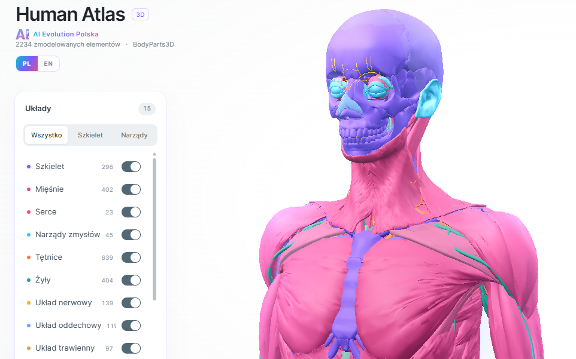

# 🫀 Human Atlas 3D — Interaktywna anatomia po polsku

<div align="center">



**Interaktywny, trójwymiarowy atlas anatomiczny człowieka — w całości po polsku.**
2 234 klikalne struktury · 15 układów ciała · 3 432 nazwane pojęcia · PL/EN

[](https://human-atlas-ai.netlify.app)
[](https://github.com/aievolutionpl)
[](https://aievolutionpolska.pl)

*Build by **AI Evolution Polska***

</div>

---

## ✨ Co to jest?

**Human Atlas 3D** to darmowe, otwartoźródłowe narzędzie edukacyjne, które pozwala
rozebrać dorosłego mężczyznę (referencyjna anatomia **BodyParts3D 4.0**) na
**2 234 indywidualnie wybieralne siatki 3D** — bezpośrednio w przeglądarce,
bez instalacji i bez pobierania czegokolwiek.

Projekt powstał jako **fork** otwartoźródłowego Human Atlas, który
**AI Evolution Polska** dopracowało i **w całości przetłumaczyło na język polski** —
interfejs, opisy narządów, a nawet **nazwy struktur anatomicznych**
(np. *Anterior tibial artery* → *tętnica piszczelowa przednia*), z zachowaniem
poprawnej polskiej terminologii anatomicznej i odmiany przez rodzaj.

> 🤖 **Vibe coding z modelami AI:** Projekt został zbudowany metodą „vibe codingu"
> przy użyciu **GPT-6** oraz **GLM 5.3**. Cały kod jest publiczny — pobierz go,
> zmieniaj i rozwijaj dalej.

## 🎯 Co daje Human Atlas?

| Funkcja | Opis |
|---|---|
| 🖱️ **Klikalna anatomia** | Najedź i kliknij dowolną z 2 234 struktur — od kości udowej po najmniejszą gałązkę tętnicy. Kliknięcie otwiera kartę z opisem po polsku. |
| 🇵🇱 **Pełny polski** | Interfejs, opisy i nazwy anatomiczne po polsku (przełącznik PL/EN). 98% nazw struktur przetłumaczone z poprawną polską fleksją. |
| 💥 **Rozsuw / składanie** | Suwak „Rozsuń anatomię" rozbiera ciało na 2 234 elementy rozmieszczone w czytelnej siatce — i składa je z powrotem. Przyciski animacji Robią to za Ciebie. |
| 🫀 **Galeria organów** | 14 najważniejszych narządów (serce, płuca, mózg…) z polskimi nazwami i opisami. Jeden klik — kamera sama kadruje narząd na ciele. |
| 🗺️ **Regiony ciała** | Szybkie kadrowanie: głowa, klatka piersiowa, brzuch, miednica, kończyny. |
| 🎚️ **Panel oświetlenia** | Ekspozycja, światło główne, tylne i wypełniające + presety (Miękkie / Standard / Kontrast). Dostosuj obraz pod swój monitor. |
| 🩻 **Efekty** | Tryb rentgenowski (szkło), etykiety struktur, poświata, autoobrót, jakość renderu. |
| 🔍 **Wyszukiwarka** | Szukaj po nazwie polskiej lub angielskiej albo identyfikatorze atlasu (FMA). |
| 🎲 **Losowa struktura** | Przycisk 🎲 losuje strukturę do odkrycia — świetne do nauki. Skróty: `R`, `F`, `X`, `/`. |
| 📱 **Mobile** | Pełna obsługa dotykowa: obracanie, szczypnięcie, przyjazne panele. |

## 🚀 Szybki start

**Online (najprościej):** otwórz **[human-atlas-ai.netlify.app](https://human-atlas-ai.netlify.app)** — działa od razu.

**Lokalnie:**

```bash
git clone https://github.com/aievolutionpl/human-atlas.git
cd human-atlas
npm install
npm run dev        # http://localhost:3016
```

Wymagania: Node.js ≥ 22.13. Build produkcyjny: `npm run build` (katalog `dist/`).

## 🛠️ Jak to działa?

Human Atlas to aplikacja **React + TypeScript + Three.js** (Vite), zoptymalizowana
pod renderowanie **tysięcy struktur jednocześnie**:

- **Zmergowane partie geometrii** — struktury są łączone w duże buffery GPU, więc
  2 234 elementy rysują się bez tysięcy osobnych draw calls. Orbita i zoom pozostają
  płynne nawet na słabszych komputerach.
- **Tekstury stanu na GPU** — widoczność, zaznaczenie i przesunięcie każdej struktury
  sterowane są przez per-strukturę tekstury, dzięki czemu rozsuwanie anatomii to
  czysty shader, bez przebudowy sceny.
- **Polski translator nomenklatury** — wbudowany słownik (~350 haseł: rzeczowniki
  z rodzajem, przymiotniki z odmianą, frazy stałe, dopełniacze) przekłada
  angielsko-łacińskie nazwy BodyParts3D na poprawną polszczyznę anatomiczną
  w czasie rzeczywistym.
- **34 MB skompresowanej geometrii** ładowane strumieniowo w 3 równoległych
  strumieniach z paskiem postępu.

Pełna atrybucja i licencja danych: [`public/ATTRIBUTION.md`](public/ATTRIBUTION.md).

## 🧬 Dane anatomiczne

Viewer korzysta z **BodyParts3D 4.0** (referencyjna anatomia dorosłego mężczyzny),
licencja **CC BY 4.0** (© The Database Center for Life Science). Model nie zawiera
każdej struktury i wariacji ludzkiego ciała; służy edukacji — **nie jest narzędziem
diagnostycznym ani chirurgicznym**.

## 💾 Użyj i rozwijaj dalej

Projekt jest **całkowicie darmowy** — kod na licencji MIT, dane na CC BY 4.0.
Możesz go klonować, modyfikować i wdrażać gdzie chcesz (Vercel, Netlify, każdy
hosting statyczny — wystarczy katalog `dist/`).

```bash
git clone https://github.com/aievolutionpl/human-atlas.git
```

Deploy jednym poleceniem (po `npm run build`):

```bash
npx netlify-cli deploy --prod --dir=dist
```

---

<div align="center">

**[AI Evolution Polska](https://aievolutionpolska.pl)** · edukacja AI po polsku

[🌐 aievolutionpolska.pl](https://aievolutionpolska.pl) · [⭐ GitHub @aievolutionpl](https://github.com/aievolutionpl) · [🫀 Live Demo](https://human-atlas-ai.netlify.app)

*Built with vibe coding — GPT-6 & GLM 5.3*

</div>
